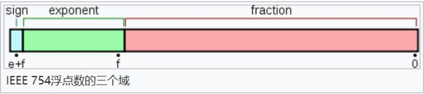

### 数据类型

#### byte 
-128（-2^7）~ 127（2^7-1）

#### short
-32768（-2^15）~ 32767（2^15 - 1）

#### int
-2,147,483,648（-2^31）~ 2,147,483,647（2^31 - 1）

#### long
-9,223,372,036,854,775,808（-2^63）~ 9,223,372,036,854,775,807（2^63 -1）

浮点类型

#### float 
单精度、32位的浮点数，占用4个字节，有效数字是7位。

符号位（sign）占用1位，用来表示正负数。

指数位（exponent）占用 8 位，用来表示指数。

小数位（fraction）占用 23 位，用来表示小数，不足位数补 0。

2^23 = 8388608，即十进制的7位，大于这个数就会丢失精度，所以严格来说只能保证6位运算

#### double
双精度、64位浮点数，占用8个字节，有效数字 16位。

2^64 = 4 503 599 627 370 496，这个数有 16 位，所以计算精度只能百分百保证十进制的 15 位运算。


### 浮点数存储与计算

#### 存储

在计算机中，保存这个数使用的是浮点表示法，分为三大部分：

第一部分用来存储**符号位（sign），**用来区分正负，这里是 0，表示正数

第二部分用来存储**指数（exponent），**这里的指数是十进制的 6

第三部分用来存储**小数（fraction），**这里的小数部分是 001110011


比如float类型是32位，是单精度浮点表示法：

符号位（sign）占用1位，用来表示正负数。

指数位（exponent）占用 8 位，用来表示指数。

小数位（fraction）占用 23 位，用来表示小数，不足位数补 0。

而 double 类型是 64 位，是双精度浮点表示法：

符号位占用 1 位，指数位占用 11 位，小数位占用 52 位。

到这里其实已经可以隐隐看出：

**指数位决定了大小范围**，因为指数位能表示的数越大则能表示的数越大嘛！

**而小数位决定了计算精度**，因为小数位能表示的数越大，则能计算的精度越大咯！

可能还不够明白，举例子吧：

float 的小数位只有 23 位，即二进制的 23 位，能表示的最大的十进制数为 2 的 23 次方，即 8388608，即十进制的 7 位，严格点，精度只能百分百保证十进制的 6 位运算。

double 的小数位有 52 位，对应十进制最大值为 4 503 599 627 370 496，这个数有 16 位，所以计算精度只能百分百保证十进制的 15 位运算。

> PS: 我们常见的科学计算器，比如高中时候用的，一般最大支持的运算位数就是 15 位，超过这个就不够准了。在实际编程中，也是用的 double 类型比较多，因为能够保证 15 位的运算。如果还需要更高精度的运算，则需要使用其他数据类型，比如 java 中的 BigDecimal 类型，能够支持更高精度的运算。

#### 指数位的偏移量与无符号表示

需要注意的是指数可能是负数，也有可能是正数，即**指数是有符号整数，**而有符号整数的计算是比无符号整数麻烦的。所以为了减少不必要的麻烦，在实际存储指数的时候，需要把指数转换成**无符号整数**。那么怎么转换呢？

注意到 float 的指数部分是 8 位，则指数的取值范围是 -126 到 +127，为了消除负数带来的实际计算上的影响（比如比较大小，加减法等），可以在实际存储的时候，给指数做一个简单的映射，加上一个**偏移量，**比如float的指数偏移量为 127，这样就不会有负数出现了。

比如：

指数如果是 6，则实际存储的是 6+127=133，即把 133 转换为二进制之后再存储。

指数如果是 -3，则实际存储的是 -3+127=124，即把 124 转换为二进制之后再存储。

当我们需要计算实际代表的十进制数的时候，再把指数减去偏移量即可。

对应的 double 类型，存储的时候指数偏移量是 1023。

#### 计算

所以用float类型来保存十进制小数78.375的话，需要先转换成浮点数，得到**符号位**和**指数**和**小数部分**。这个例子前面已经分析过，所以：

符号位是0，指数位是6+127=133，二进制表示为10 000 101，小数部分是001110011，不足部分请自动补0。

连起来用 float 表示，加粗部分是指数位，最左边是符号位 0，代表正数：

0 **10000101** 001110011 00000 00000 0000

如果用 double 来保存。。。自己计算吧，太多 0 了。

Java 浮点类型 float 和 double 的主要区别，它们的小数精度范围大小是多少？ - Boss呱呱的回答 - 知乎 https://www.zhihu.com/question/46432979/answer/221485161

### 0.1d+0.2d

二进制的计算机中表示十进制的小数，如0.375：

0.375(10) = 0.011(2)

小数点后面的位数依次表示十进制中的 0.5、0.25、0.125 和 0.0625 等等，即

(二进制数 => 十进制指数 => 十进制分数 => 十进制小数)
0.1 = 2^-1 = 1/2 = 0.5

0.01 = 2^-2 = 1/4 = 0.25

0.01 = 2^-3 = 1/8 = 0.125

0.001 = 2^-4 = 1/16 = 0.0625

......

0.5、0.25、0.125...这些数在二进制中看起来像是“整数”，每一位都是前一位的一半，但是0.1和0.2这样的数在二进制中的表示就比较复杂了。

0.1(10) = 0.00011001100...(2)

0.2(10) = 0.0011001100...(2)

在二进制中，0.1和0.2这样的数都没法精确表示，所以在Java、JavaScript等一些语言中0.1+0.2的结果就会是：

```bash
//Java
System.out.println(0.1d + 0.2d);
//输出 0.30000000000000004

//JavaScript
console.log(0.1+0.2)
//输出 0.30000000000000004
```

所以在Java中涉及精确的浮点计算要使用BigDecimal这样的工具。